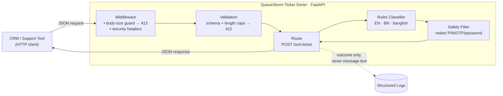
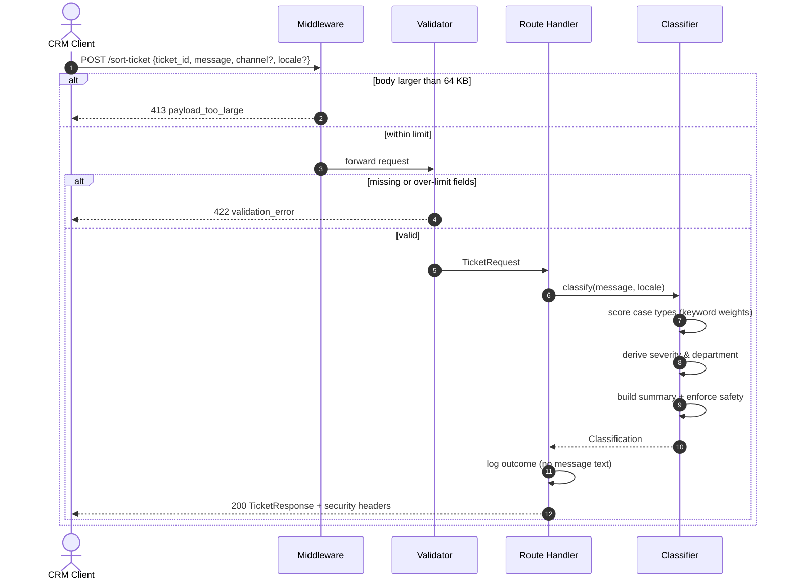
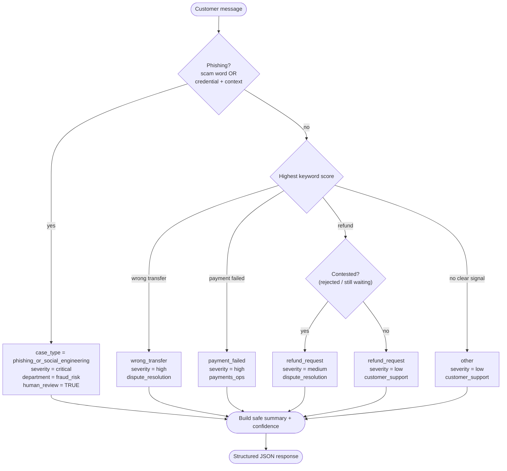
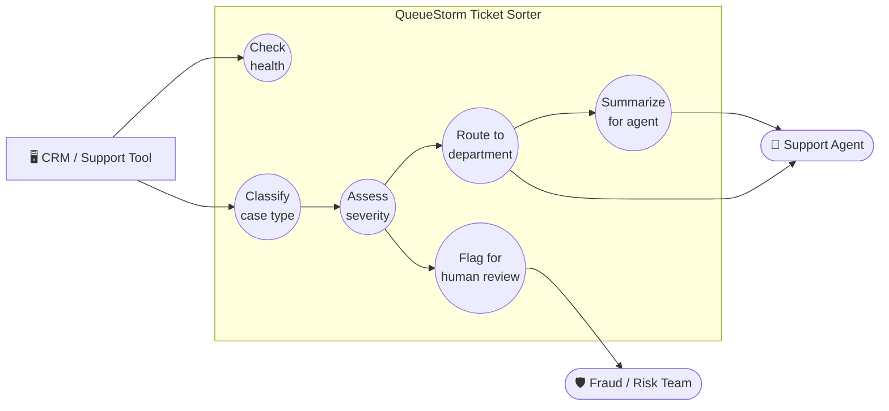

<div align="center">

# 🎯 QueueStorm Ticket Sorter

**An intelligent triage service that reads one customer support message and instantly answers: what is it, how urgent, who owns it, and a two-second summary — flagging phishing and critical cases for a human.**

_bKash · SUST CSE Carnival 2026 — Codex Community Hackathon · **Mock Preliminary**_


[](https://github.com/darklight9911/QueueStorm_Warmup/actions/workflows/ci.yml)


</div>

---

## Table of Contents

- [Overview](#overview)
- [Key Features](#key-features)
- [System Architecture](#system-architecture)
- [Request Sequence](#request-sequence)
- [Classification Logic (Activity Diagram)](#classification-logic-activity-diagram)
- [Use Cases](#use-cases)
- [Quick Start](#quick-start)
- [API Reference](#api-reference)
- [How Classification Works](#how-classification-works)
- [Reliability & Security](#reliability--security)
- [Public Sample Cases](#public-sample-cases)
- [Testing](#testing)
- [Deployment Runbook](#deployment-runbook)
- [Configuration](#configuration)
- [Project Layout](#project-layout)
- [Submission Notes](#submission-notes)
- [Security](#security)
- [License](#license)

---

## Overview

On a busy afternoon a digital-finance support queue fills with very different
problems: money sent to the wrong number, payments that failed mid-transaction,
refund requests, and scammers fishing for OTPs and PINs. A human can't read every
ticket from scratch. **QueueStorm** reads one message and returns a structured
classification an agent can act on in two seconds:

| Question | Field |
|---|---|
| What kind of problem is this? | `case_type` |
| How serious is it? | `severity` |
| Which team should handle it? | `department` |
| What happened, in one sentence? | `agent_summary` |
| Does a human need to look now? | `human_review_required` |

The engine is **rules-based, deterministic, and dependency-light** — no LLM, no GPU,
no secrets, no external API calls. That makes it **fast** (sub-millisecond
classification), **free** to run, and **100% reproducible** for the grader. It
understands **English, Bengali script, and romanized "banglish" / mixed** messages.

---

## Key Features

- ⚡ **Deterministic & fast** — weighted keyword scoring; no model inference, same input → same output.
- 🌐 **Multilingual** — English, Bengali (বাংলা), and banglish/mixed phrasing.
- 🛡️ **Safety-first** — phishing and critical cases are flagged for human review; the summary can never ask a customer to share a PIN/OTP/password/card.
- 🧱 **Hardened API** — request-size limits, clean JSON error contract, security headers, privacy-aware logging.
- 🐳 **Clone-and-run** — one `docker compose up` (or a dev container); portable image honours `$PORT`.
- ✅ **Well tested** — 27 automated tests covering every sample case, the safety rule, and the hardening.

---

## System Architecture



Every request passes through a thin pipeline: a **middleware** guard rejects
oversized bodies and stamps security headers, **Pydantic** validates the schema and
length caps, the **route** delegates to the **classifier**, and a **safety filter**
guarantees the summary is free of credential prompts before the response goes out.

---

## Request Sequence



---

## Classification Logic (Activity Diagram)



Phishing is evaluated **first** (safety-first): a single credential word is not
enough — it must co-occur with a request/contact context, or an explicit scam word
must appear. Everything else is decided by the highest-scoring keyword bank, with a
fixed priority order breaking ties.

---

## Use Cases



| Actor | Goal |
|---|---|
| **CRM / Support Tool** | Submit a raw ticket and get a structured triage result; probe `/health`. |
| **Support Agent** | Read a two-second summary and pick up tickets routed to their team. |
| **Fraud / Risk Team** | Immediately receive phishing / critical tickets flagged for review. |

---

## Quick Start

### Docker (recommended) — clone → run, zero config

```bash
git clone https://github.com/darklight9911/QueueStorm_Warmup.git
cd QueueStorm_Warmup
docker compose up --build      # builds the image and starts the API on :8000
```

```bash
curl http://localhost:8000/health
```

> Opening the folder in **VS Code** with the *Dev Containers* extension? Choose
> **"Reopen in Container"** — `.devcontainer/` builds and starts everything for you.

### Without Docker

```bash
python -m venv .venv && source .venv/bin/activate
pip install -r requirements.txt
uvicorn app.main:app --host 0.0.0.0 --port 8000
```

### Makefile shortcuts

Run `make` (or `make help`) to list every target.

| Command | What it does |
|---|---|
| `make install` | Create `.venv` and install all dependencies |
| `make run` | Run the API locally on `:8000` |
| `make dev` | Run locally with auto-reload |
| `make test` | Run the full test suite |
| `make up` | Build + start via Docker Compose (detached) and check health |
| `make smoke` | Hit `/health` and a sample `/sort-ticket` on a running server |
| `make down` | Stop and remove the Docker Compose stack |
| `make logs` | Follow container logs |
| `make clean` | Remove Python/test caches |

Override tunables on the CLI, e.g. `make run PORT=9000`.

---

## API Reference

### `GET /health`

Liveness probe — returns within milliseconds (well under the 10s limit).

```json
{ "status": "ok", "service": "queuestorm-ticket-sorter", "version": "1.0.0" }
```

### `POST /sort-ticket`

Classify one CRM ticket — responds well under the 30s limit.

**Request**

| Field | Type | Required | Notes |
|---|---|---|---|
| `ticket_id` | string | Yes | Echoed back verbatim in the response |
| `message` | string | Yes | Free-text customer complaint |
| `channel` | string | No | `app`, `sms`, `call_center`, `merchant_portal` |
| `locale` | string | No | `bn`, `en`, `mixed` |

> `channel` and `locale` are accepted leniently — an unexpected value never turns a
> valid ticket into an error.

**Response**

| Field | Type | Notes |
|---|---|---|
| `ticket_id` | string | Matches the request |
| `case_type` | enum | `wrong_transfer`, `payment_failed`, `refund_request`, `phishing_or_social_engineering`, `other` |
| `severity` | enum | `low`, `medium`, `high`, `critical` |
| `department` | enum | `customer_support`, `dispute_resolution`, `payments_ops`, `fraud_risk` |
| `agent_summary` | string | One neutral sentence |
| `human_review_required` | boolean | `true` for critical severity or phishing |
| `confidence` | number | Float in `[0, 1]` |

**Example**

```bash
curl -X POST http://localhost:8000/sort-ticket \
  -H 'Content-Type: application/json' \
  -d '{
        "ticket_id": "T-001",
        "channel": "app",
        "locale": "en",
        "message": "I sent 5000 taka to a wrong number this morning, please help me get it back"
      }'
```

```json
{
  "ticket_id": "T-001",
  "case_type": "wrong_transfer",
  "severity": "high",
  "department": "dispute_resolution",
  "agent_summary": "Customer reports sending a transfer of 5,000 BDT to the wrong recipient and requests that the money be recovered.",
  "human_review_required": false,
  "confidence": 0.94
}
```

Interactive API docs (Swagger UI) are served at **`/docs`** (disable with `ENABLE_DOCS=false`).

---

## How Classification Works

Each candidate `case_type` accumulates a **weighted score** from keyword hits
(English + banglish + Bengali). The highest score wins; ties break by a
**safety-first priority order**: `phishing → wrong_transfer → payment_failed →
refund → other`.

- **Phishing** triggers only when a credential word (OTP/PIN/password/CVV/card)
  co-occurs with a request/contact context (*"someone **called asking**…"*), **or** an
  explicit scam/fraud word appears. So *"I forgot my password"* is **not** flagged.
- **Severity** maps from case type: phishing → `critical`; wrong transfer & failed
  payment → `high`; refund → `low` (or `medium` when contested); other → `low`.
- **Department** follows the case type; a contested refund is routed to
  `dispute_resolution`.
- **`human_review_required`** is `true` for any phishing or critical case.
- **`confidence`** scales with the winning score and its margin over the runner-up.

### Safety Rule (spec §5) — enforced in code

The `agent_summary` is built from neutral templates that **never** name a
PIN/OTP/password/card, then passed through `enforce_summary_safety()`, which redacts
any imperative asking a customer to share a secret. Covered by the automated test
`test_safety_rule_summary_never_requests_secrets`.

---

## Reliability & Security

The service is built to stay up and stay quiet about its internals:

- **Resilient endpoint** — if classification ever raises, the request degrades to a
  safe `other` / `low` response instead of a `500`. One bad ticket can't take the
  service down.
- **Clean error contract** — unhandled errors and validation failures return
  structured JSON (`{"error": "...", ...}`), never a stack trace.
- **Request limits** — bodies over `MAX_BODY_BYTES` (64 KB) → `413`; an over-length
  `message` → `422`. Cheap protection against oversized/abusive payloads.
- **Security headers** on every response: `X-Content-Type-Options: nosniff`,
  `X-Frame-Options: DENY`, `Referrer-Policy: no-referrer`, `Cache-Control: no-store`.
- **Privacy-aware logging** — logs record the *outcome* (ticket id, case, severity),
  **never the raw message**, which may contain personal data or the very credentials
  (OTP/PIN) we are protecting.
- **No secrets · non-root container · pinned dependencies.** Docs can be disabled in
  production with `ENABLE_DOCS=false`.

---

## Public Sample Cases

| # | Message | `case_type` | `severity` |
|---|---|---|---|
| 1 | I sent 3000 to wrong number | `wrong_transfer` | high |
| 2 | Payment failed but balance deducted | `payment_failed` | high |
| 3 | Someone called asking my OTP, is that bKash? | `phishing_or_social_engineering` | critical |
| 4 | Please refund my last transaction, I changed my mind | `refund_request` | low |
| 5 | App crashed when I opened it | `other` | low |

All five are asserted in `tests/test_api.py`.

---

## Testing

```bash
pip install -r requirements-dev.txt
pytest -q          # or: make test
```

**27 tests** across `tests/` cover all five sample cases, the safety rule, the
`ticket_id` echo, request validation, lenient channel/locale handling,
Bengali/banglish input, security headers, request-size limits (`413`/`422`), and
classifier-failure resilience.

---

## Deployment Runbook

The single `Dockerfile` runs anywhere. It binds to `0.0.0.0` and reads `$PORT`, which
every managed platform injects automatically. Health-check path is **`/health`**.

### Render (Blueprint included)
1. Push this repo to GitHub.
2. Render dashboard → **New + → Blueprint** → select the repo. `render.yaml` is
   detected automatically (Docker runtime, health check `/health`).
3. Deploy. Base URL: `https://<service>.onrender.com`.

### Railway
1. **New Project → Deploy from GitHub repo.**
2. Railway detects the `Dockerfile`; `$PORT` is injected.
3. **Settings → Networking → Generate Domain** for a public HTTPS URL.

### Fly.io
```bash
fly launch --no-deploy        # detects the Dockerfile; keep the generated fly.toml
fly deploy
```
HTTPS on `https://<app>.fly.dev`. Ensure the internal port is `8000`.

### Plain VM / EC2 / Poridhi Lab (Docker)
```bash
git clone https://github.com/darklight9911/QueueStorm_Warmup.git && cd QueueStorm_Warmup
docker compose up --build -d
# Front it with Caddy/Nginx (or the platform's TLS) for public HTTPS.
```

### Verify any deployment
```bash
curl https://<your-base-url>/health
curl -X POST https://<your-base-url>/sort-ticket \
  -H 'Content-Type: application/json' \
  -d '{"ticket_id":"T-001","message":"I sent 3000 to wrong number"}'
```

---

## Configuration

All configuration is via environment variables — **there are no secrets**. See
`.env.example`; never commit a real `.env` (it is git-ignored).

| Variable | Default | Purpose |
|---|---|---|
| `PORT` | `8000` | HTTP bind port (most platforms inject this) |
| `MAX_BODY_BYTES` | `65536` | Max request body size before `413` |
| `MAX_MESSAGE_LENGTH` | `10000` | Max `message` characters before `422` |
| `MAX_TICKET_ID_LENGTH` | `200` | Max `ticket_id` characters before `422` |
| `ENABLE_DOCS` | `true` | Set `false` to hide `/docs` & `/openapi.json` |
| `LOG_LEVEL` | `INFO` | Logging verbosity |

---

## Project Layout

```
.
├── app/
│   ├── __init__.py
│   ├── main.py            # FastAPI app, middleware, error handlers, routes
│   ├── models.py          # Pydantic request/response contracts + limits
│   └── classifier.py      # Deterministic rules-based classification engine
├── tests/
│   ├── test_api.py        # HTTP contract + sample cases + safety rule
│   ├── test_classifier.py # Unit / edge cases (Bengali, banglish, ...)
│   └── test_hardening.py  # Security headers, size limits, resilience
├── Dockerfile             # Small, non-root, $PORT-aware image
├── docker-compose.yml     # One-command local run
├── render.yaml            # Render deploy blueprint
├── Makefile               # Dev / test / Docker task runner
├── .devcontainer/         # VS Code "Reopen in Container" config
├── .github/workflows/     # CI: runs the test suite on every push / PR
├── requirements.txt       # Runtime dependencies
├── requirements-dev.txt   # + test dependencies
├── .env.example           # Documented config knobs (no secrets)
├── LICENSE                # MIT license
├── SECURITY.md            # Security policy & posture
└── README.md
```

---

## Submission Notes

- **LLM used:** No — fully rules-based and deterministic.
- **GPU:** None required.
- **Secrets in repo:** None.
- **Deployment platform:** Docker image (Render blueprint included; portable to Railway / Fly / EC2 / Poridhi Lab).
- **Known issues:** Classification is keyword-driven, so highly unusual phrasings may
  fall back to `other`; extending the keyword banks in `app/classifier.py` is trivial.

---

## Security

The service stores no data and needs no secrets. Highlights: privacy-aware logging
(never logs the raw message), the enforced safety rule, request-size limits, security
headers, and a non-root container. See **[SECURITY.md](SECURITY.md)** for the full
policy, threat model, and how to report a vulnerability.

---

## License

Released under the **MIT License** — free to use, modify, and distribute with
attribution. See **[LICENSE](LICENSE)**.

<div align="center">

_Built for the SUST CSE Carnival 2026 — Codex Community Hackathon._

</div>
